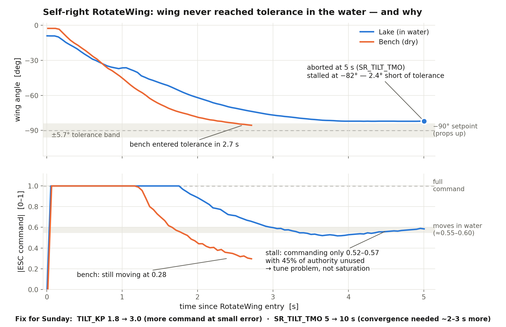

# Self-Right Lake Test — Slide Content (2026-08-13)

Source analysis: [self_right_lake_test_2026-08-13.md](self_right_lake_test_2026-08-13.md).
Figure: `self_right_stall_figure.png` (built from `wing_tilt_status` in
`auto_self_right_attempt_18_27_11.ulg` and `60_percent_bench_test_114_2026-8-12-21-53-14.ulg`).

## Slide 1 — First autonomous self-right attempt in open water: what happened

- First lake test of the autonomous self-right sequence (2026-08-13); the safety design
  worked — props never spun with the wing out of position, and every abort ended in a
  clean self-disarm
- The wing drove from −9° to −82° but timed out 2.4° short of the ±5.7° tolerance around
  the −90° props-up target; the thrust phase never started
- Log analysis ruled out actuator saturation: the actuator slews at 60–70°/s at full
  command, but the loop stalled while commanding only ~55% of available authority
- Root cause: water roughly **doubles** the command needed to keep the wing moving
  (~0.55–0.6 vs ~0.28 dry) — gains tuned on the bench under-command near the target, and
  only the slow integral was left to close the last degrees (~2–3 s more than the timeout
  allowed)
- Bonus finding: the wing encoder failed mid-session from water intrusion (corrupted I2C
  reads, then dead bus); the precondition gate correctly refused two retry attempts
  without moving anything — encoder since replaced

## Slide 2 — Fixes made and plan for Sunday

- Parameter fixes, no hardware changes needed (hardware capability already proven by the
  earlier manual flip): `TILT_KP` 1.8 → 3.0 (more command at small error) and tilt
  timeout 5 → 10 s (time the convergence actually needed)
- Firmware improvements landed: ESC arming sequence cut from 5 wiggle cycles to 2 (it
  arms on the first), and the post-arm return-to-zero rewritten — it previously stalled
  below the ESC motion threshold and never moved; now a fixed drive parks the wing
  within ~1° of boot zero
- Removed the landed/at-rest entry checks: the land detector is unreliable floating on
  water; inversion + EKF + encoder + battery gates remain
- Documented: full log analysis, revised test procedure, and an on-site contingency plan
  (abort-reason triage table, pre-staged fallback params, and the proven manual-flip
  procedure as backstop)
- Sunday: bench-verify new encoder + Kp 3.0 (props off), waterproof the encoder, then
  repeat the water test — expect wing in tolerance in ~4–8 s, then thrust ramp →
  over-center → disarm
