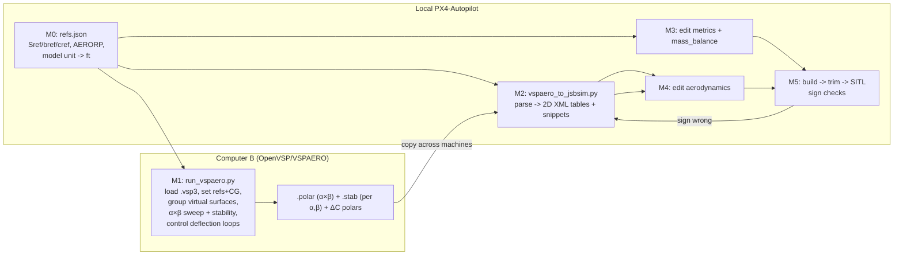

# Plan: Port VSPAERO aero data into the twin_tractor JSBSim model (v2)

> **SUPERSEDED (2026-07):** the port shipped via `tools/stab_to_jsbsim.py` (naming and details
> differ from this plan — see `jsbsim_sitl.md` §3 and the model's `tools/README.md`), and the
> VSPAERO pipeline itself is slated to be replaced by an advanced aero + stall model from a
> separate repo. Kept for reference only.

## Context
The JSBSim `twin_tractor` (2-motor, V-tail port of the Gazebo `twin_tractor_seaplane`) now **runs
and takes off** — the spin-up torque-roll was fixed by switching engines to `brushless_dc_motor`
with counter-rotating props. But it "doesn't fly all that well" because its `<metrics>`,
`<mass_balance>`, and `<aerodynamics>` are still **Rascal placeholders** (header note at
`twin_tractor.xml:11-16`): Rascal coefficients on twin geometry/mass, with a conventional-tail
derivative set rather than this airframe's V-tail. You have an OpenVSP model; the goal is to drive
**VSPAERO** to generate real aerodynamics and fold them into the FDM.

This plan is built as **six self-contained milestones, meant to be implemented one per session.**
Each milestone lists its **Inputs → Work → Deliverable → Done check** so you can stop after any one
and resume cleanly. Dependencies run strictly forward (M0→M5); nothing in a later milestone is
needed to complete an earlier one.

### Where each step runs (confirmed)
- **Computer B (has OpenVSP/VSPAERO):** M1 — the VSPAERO automation script and its outputs.
- **Local PX4-Autopilot checkout:** M0 (reference contract), M2–M5 — conversion script, FDM edits,
  build, SITL. All FDM paths are under
  `Tools/simulation/jsbsim/jsbsim_bridge/models/TwinTractor/`.
- **This remote session is plan-only.** It is a clone of `px4-jsbsim-bridge` and does **not** contain
  `twin_tractor.xml`, the PX4 build, or VSPAERO. No file here can be edited or built — treat every
  `twin_tractor.xml:NN` line ref as your *local* file and confirm it before editing.

### Locked-in decisions

**Control model = virtual surfaces.** Three VSPAERO control groups map onto the existing FCS
outputs `fcs/elevator-pos-rad`, `fcs/rudder-pos-rad`, `fcs/left-aileron-pos-rad`. Gains and
observed behavior have been **verified in the OpenVSP visualizer** and documented in
`CONTROL_SURFACES.md` (see Critical Files). The FCS (`twin_tractor.xml:188-314`) stays as-is.

| Group | Sub-surfaces | Gains | Verified behavior |
|---|---|---|---|
| Aileron → `fcs/left-aileron-pos-rad` | `Wing_Surf0_ail`, `Wing_Surf1_ail` | +1, +1 | Positive → roll left |
| Elevator → `fcs/elevator-pos-rad` | `Tail_Surf0_Ruddervator`, `Tail_Surf1_Ruddervator` | +1, −1 | Positive → nose down |
| Rudder → `fcs/rudder-pos-rad` | `Tail_Surf0_Ruddervator`, `Tail_Surf1_Ruddervator` | +1, +1 | Positive → yaw right |

**JSBSim elevator sign convention (confirmed from documentation):** positive `fcs/elevator-pos-rad`
= stick forward = trailing edge down = nose down. This is consistent with VSPAERO's positive
elevator group deflection producing nose down. `Cm_de` will be negative in both; no flip needed
at the JSBSim boundary. Elevator is confirmed consistent end-to-end.

**Aileron sign ambiguity (unresolved — check in M5):** JSBSim documentation gives two plausible
interpretations of `fcs/left-aileron-pos-rad` polarity. Before M5 SITL check, open the existing
`twin_tractor.xml` aero block and read the sign of the existing `Cl_da` coefficient — if positive,
JSBSim expects roll-right per positive command and a flip will be needed; if negative, signs agree.

**Solver = hybrid VLM + panel.** The wing and tail are modeled with VLM; the fuselage hull uses
the panel method. This captures fuselage crossflow contributions to `CY`, `Cl`, and `Cn` that
pure VLM misses, and introduces potential nonlinearity in sideslip derivatives — relevant for
AHAB's hull geometry and directly relevant to the landing behavior issues observed in flight
testing (roll oscillation at low speed, yaw rotation during deceleration).

**Fidelity target = Tier 3** (see fidelity envelope below). JSBSim supports 2D and 3D tables
natively so there is no toolchain ceiling preventing this. Mach sweep is the only Tier 3
dimension that is explicitly skipped (M ≈ 0.05, compressibility negligible).

**Scope = aero + metrics + mass only.**

**Both helper scripts are Python, pure-stdlib where possible** (the run script needs the OpenVSP
Python API; the converter needs nothing beyond stdlib).

**The `.vspaero` input file has already been manually constructed and verified** during this
session. It lives at `models/TwinTractor/tools/vspaero/ahab_DegenGeom.vspaero` and contains
the correct control group definitions, surface names, and `VSP_StabilityType = 1`. The M1 script
must reproduce this configuration programmatically and produce identical outputs.

---

## Pipeline shape



---

## Key reference: how the two formats relate
JSBSim builds each force as `qbar·Sref·C` and each moment as `qbar·Sref·refLen·C`, where `refLen`
is span (`metrics/bw-ft`) for ROLL/YAW and chord (`metrics/cbarw-ft`) for PITCH. The placeholder
already has this skeleton — every `<function>` is `qbar · S · [refLen] · <independentVar> · <value>`.
VSPAERO outputs the dimensionless `C` and its derivatives `dC/dX`, so **each JSBSim leaf entry is
literally a VSPAERO value or derivative; the surrounding `<product>` supplies the
dimensionalization and the independent variable.** With Tier 3 the leaf `<value>` becomes a 2D
`<table>`, but the surrounding product structure is unchanged.

### The four reconciliations (the crux)
1. **Reference quantities must match.** VSPAERO `Sref/bref/cref` must equal JSBSim
   `metrics/wingarea|wingspan|chord`. Set them in the run (M1), convert to JSBSim units (`FT`,`FT2`).
   Coefficients are dimensionless so they don't scale, but the metric reference dims must be the
   *same physical references* VSPAERO normalized against, or every moment is wrong.
   **Confirmed values from `.vspaero` file:** `Sref=0.425 m²`, `Bref=1.7 m`, `Cref=0.25 m`.
   Cross-check against OpenVSP geometry tool output before locking into `refs.json`.
2. **Moment reference center must equal AERORP.** JSBSim applies aero loads at `metrics/AERORP`
   then transfers to CG. Set VSPAERO's moment reference (X/Y/Z cg) equal to the `<location
   name="AERORP">` value. **Confirmed value from `.vspaero` file:** `X_cg=0.445 m`, `Y_cg≈0`,
   `Z_cg=0`. Otherwise `Cm`/static margin is referenced to the wrong point.
3. **Axis system + signs.** VSPAERO CL/CD/CS are wind-axis forces → JSBSim `LIFT`/`DRAG`/`SIDE`
   (wind axes, as Rascal uses). VSPAERO CMl/CMm/CMn → JSBSim `ROLL`/`PITCH`/`YAW` (body axes about
   AERORP). **Validate with sign checks and flip `<value>`/`<table>` signs as needed — do NOT trust
   raw signs.** See `CONTROL_SURFACES.md` for the starting sign map.
4. **Rate non-dimensionalization.** VSPAERO reports rate derivatives w.r.t. *dimensionless* rates
   `p̂=p·bref/2V`, `q̂=q·cref/2V`, `r̂=r·bref/2V`. JSBSim builds the same nondimensionalization via
   `aero/bi2vel` (b/2V) and `aero/ci2vel` (c/2V) times the body rate. So the derivative drops
   directly into `Clp/Clr/Cmq/Cnp/Cnr` **provided bref/cref match (step 1)**. Verify the convention
   in the `.stab` header — VSPAERO versions vary; adjust if it reports per-(rad/s).

**Sign sanity checks (stable aircraft):** `Cm_alpha<0`, `Cl_beta<0` (dihedral), `Cn_beta>0`
(weathercock), `Cl_p<0`, `Cm_q<0`, `Cn_r<0`. Control: elevator-up→nose-up, right-aileron→roll-right.
Reconcile against the PX4/FCS sign convention during the SITL check.

---

## VSPAERO fidelity envelope and sweep strategy

### What VSPAERO can vary

| Mode | Independent variables | Output | What you get |
|---|---|---|---|
| **Sweep** (`VSPAEROSweep`) | Alpha, Beta, Mach, ReCref — full Cartesian product | `.polar` | `CL, CD, CDi, CDo, CS, CMl, CMm, CMn` at every grid point |
| **Stability** (`StabilityType≠OFF`) | Finite-difference perturbations about each operating point in alpha, beta, p, q, r, and each control group | `.stab` | All derivatives: `CLα, Cmα, CYβ, Clβ, Cnβ, Clp, Clr, Cmq, Cnp, Cnr, Cmde, Clda, Cndr, …` |
| **Deflection loop** (scripted) | Fixed δ per run; α swept at each δ | Set of `.polar` files | `ΔC(α, δ)` increment tables per control group |

Key facts that set the ceiling:
- **Hybrid solver:** the panel method on the hull resolves fuselage pressure at sideslip, introducing
  real nonlinearity in `CY`, `Cl`, `Cn` vs beta that pure VLM cannot capture. This is the primary
  reason the beta sweep is a standard run here rather than an optional verification.
- **Control surfaces are not a free Sweep axis** — effectiveness comes from the Stability
  finite-difference perturbation (one derivative per group per operating point) or from a scripted
  deflection loop for the full nonlinear `ΔC(α,δ)` table.
- **Stability runs at every point of the Alpha×Beta array**, so you get every derivative as a
  function of (α,β) — a `.stab` block per grid point.
- **Hard ceiling — hybrid solver is still inviscid:** no stall, no flow separation, viscous drag
  only from flat-plate `ReCref/Cf` buildup. VLM/panel control response is ~linear in δ.

### Fidelity tiers

| Tier | What you run | JSBSim representation | When to use |
|---|---|---|---|
| **0** | Single stability run at cruise α, β=0 | All terms as `<value>` constants | Baseline only |
| **1** | Alpha sweep at β=0 | `CL(α), CD(α), Cm(α)` as 1D tables; lateral constants | Minimum useful |
| **2** | Alpha sweep + stability at each α | All lateral/damping/control terms as 1D `<table>` on `aero/alpha-rad` | Good for symmetric flight |
| **3 (default)** | α×β sweep + stability at each (α,β) + control deflection loops | All force/moment coefficients as 2D `<table>` on (α,β); `ΔC(α,δ)` 2D tables per surface | Recommended — captures hull crossflow nonlinearity |

**Mach is the only Tier 3 dimension explicitly skipped** (M≈0.05, compressibility negligible).
A Mach sweep would produce 3D tables `C(α,β,M)` which JSBSim supports, but adds no fidelity here.

### Sweep arrays (Tier 3)

**Alpha:** −6° to +12°, 2° steps (10 points). Covers full flight envelope through stall margin.
VLM gives no stall, so the post-stall break is added manually in M4.

**Beta:** −10° to +10°, coarse steps: {−10, −6, −4, −2, 0, 2, 4, 6, 10} (9 points). Inspect
`CY`, `Cl`, `Cn` vs β from the resulting 2D polar before building tables — if curves are
straight lines across all α (indicating the panel method didn't add nonlinearity for this hull),
fall back to Tier 2 for the lateral coefficients. If there is curvature, keep the 2D tables.

**Control deflection loop (per group):** δ ∈ {−20, −10, 0, 10, 20}° at each α point. Run α
sweep at each fixed δ. Build `ΔC(α,δ) = C(α,δ) − C(α,0)` increment table. VLM response is
~linear in δ so this primarily confirms linearity and bounds any nonlinear effect from panel
method interference at extreme deflections.

**Full run count:** 10α × 9β = 90 sweep points + stability at each = 90 stability blocks +
3 groups × 5 δ values × 10α sweep = 150 deflection-loop runs. Script this; do not do it manually.

### JSBSim 2D table structure (for reference)
```xml
<table>
  <independentVar lookup="row">aero/alpha-rad</independentVar>
  <independentVar lookup="column">aero/beta-rad</independentVar>
  <tableData>
          -0.175  -0.105  -0.070  -0.035  0.000  0.035  0.070  0.105  0.175
  -0.105  ...
   0.000  ...
   0.105  ...
  </tableData>
</table>
```

---

## M0 — Reference contract (local)
The single source of truth that M1, M2, M3 all read so the references stay consistent across machines.

- **Inputs:** the `.vsp3` geometry numbers (wing area/span/MAC), intended CG/aero center, OpenVSP
  model length unit. The `.vspaero` file provides a starting point: `Sref=0.425`, `Bref=1.7`,
  `Cref=0.25`, `X_cg=0.445`.
- **Work:** create `models/TwinTractor/tools/refs.json` recording: `sref`, `bref`, `cref` (in OpenVSP
  units **and** converted to ft/ft²), `aerorp` `[x,y,z]` (the moment ref point = `X_cg/Y_cg/Z_cg`
  from the `.vspaero` file), `model_unit` and its `to_ft` factor, and the cruise condition
  (`vinf=20`, `rho=0.002377 slug/ft³`, `mach=0.059`, `recref=340000`).
- **Deliverable:** `refs.json`, committed.
- **Done check:** `cref ≈ sref / bref` (0.425/1.7 = 0.25 ✓); `aerorp` lands near the quarter-MAC.
  Cross-check `sref` and `bref` against the OpenVSP geometry tool's reported wing area and span —
  the `.vspaero` values (0.425 m², 1.7 m) differ ~5% from the paper's design targets (0.45 m²,
  1.80 m); use what the model actually is. This file is later asserted against `<metrics>` (M3)
  by the converter (M2), so getting it right now prevents silent moment errors.

---

## M1 — VSPAERO automation script (Computer B)
Replaces the manually constructed `.vspaero` file with a repeatable script. The `.vspaero` file
produced in this session is the reference to validate against on first run.

- **Inputs:** `.vsp3` model, `refs.json` (M0), verified `.vspaero` file as reference.
- **Work:** write `run_vspaero.py` using the **OpenVSP Python API** (`import openvsp as vsp`):
  1. `vsp.ReadVSPFile(<model>.vsp3)`.
  2. **Reference geometry:** set `Sref/bref/cref` from `refs.json`.
  3. **Moment reference:** set `X_cg/Y_cg/Z_cg` = `refs.aerorp`.
  4. **Control surface groups** — use the verified gains from `CONTROL_SURFACES.md`:
     ```
     Aileron:  Wing_Surf0_ail (+1), Wing_Surf1_ail (+1)
     Elevator: Tail_Surf0_Ruddervator (+1), Tail_Surf1_Ruddervator (-1)
     Rudder:   Tail_Surf0_Ruddervator (+1), Tail_Surf1_Ruddervator (+1)
     ```
     Confirm exact surface names against the DegenGeom — case-sensitive, zero-indexed.
     VSPAERO silently ignores unrecognized names rather than erroring; a zero derivative
     in `.stab` means a name didn't match.
  5. **Flight condition:** `Vinf=20`, `Rho=0.002377`, `Mach=0.059`, `ReCref=340000`
     (single Mach point — no Mach sweep at M≈0.05).
  6. **Solver:** hybrid VLM+panel (wing/tail = VLM, hull = panel). Confirm the panel assignment
     matches what the GUI was using.
  7. **DegenGeom:** run the compute-geometry analysis before the sweep.
  8. **Tier 3 sweep — main run:**
     - Alpha array: −6° to +12°, 2° steps (10 points).
     - Beta array: {−10, −6, −4, −2, 0, 2, 4, 6, 10}° (9 points).
     - Full Cartesian product (90 operating points).
     - `StabilityType = 1` so `.stab` is written with one block per (α,β) point.
  9. **Tier 3 deflection loops:**
     For each control group in {Aileron, Elevator, Rudder}:
       For each δ in {−20, −10, 0, 10, 20}°:
         Set group deflection to δ, run α sweep at β=0, save `.polar` to
         `vspaero/<group>_d<delta>.polar`.
     These are combined in M2 to form `ΔC(α,δ)` increment tables.
  10. **Validation:** compare key values at (α=0, β=0) against the manually produced `.stab` to
      confirm the script reproduces the same configuration.
  11. Print paths of all output files.
- **Deliverable:** `models/TwinTractor/tools/run_vspaero.py` + outputs:
  `<model>_DegenGeom.polar`, `.stab`, `.history`, and per-group deflection polars.
- **Done check:** `.history` converged; `.stab` at cruise α passes the sign checks; `Cmde < 0`,
  `Clda < 0`, `Cndr > 0` (per `CONTROL_SURFACES.md`); re-running reproduces identical outputs.

### Artifact handoff (Computer B → local)
Copy all outputs into `models/TwinTractor/tools/vspaero/`. `refs.json` already lives locally.

---

## M2 — Conversion script (local)
- **Inputs:** `.polar` (α×β), `.stab` (per (α,β) block), deflection polars, `refs.json`,
  placeholder `twin_tractor.xml` as structural template.
- **Work:** write `models/TwinTractor/tools/vspaero_to_jsbsim.py` (pure stdlib):
  - Parse the **α×β sweep polar** → 2D `<table>` entries keyed on `(aero/alpha-rad,
    aero/beta-rad)` for all six force/moment coefficients: `CL`, `CD`, `CS`, `Cl`, `Cm`, `Cn`.
    **Convert α and β deg→rad** for the table breakpoints.
  - Parse the **per-(α,β) `.stab` blocks** → emit each rate/damping/control derivative as a 2D
    `<table>` on `(aero/alpha-rad, aero/beta-rad)`: `CYb`, `Clb`, `Cnb`, `Clp`, `Clr`, `Cmq`,
    `Cnp`, `Cnr`, `Cmde`, `Clda`, `Cldr`, `Cndr`, `Cnda`, `CYdr`. If the beta sweep inspection
    confirms linearity in the lateral derivatives (straight lines vs β), emit those as 1D
    α-tables instead — use `--constant-beta-derivs` flag to force this.
  - Parse the **deflection loop polars** → for each control group, build
    `ΔC(α,δ) = C(α,δ) − C(α,0)` and emit as a 2D `<table>` on `(aero/alpha-rad, fcs/*-pos-rad)`.
    If curves are linear in δ (as expected from VLM), emit the single Stability derivative
    instead and log a note — use `--confirm-linear-controls` flag.
  - **Reconciliations:**
    - Assert `refs.json` Sref/bref/cref match `<metrics>` values (fail loudly — guard #1).
    - Map rate convention to bi2vel/ci2vel from `.stab` header (guard #4).
    - Apply sign map from `CONTROL_SURFACES.md` (per-coefficient flip dict, default all +1).
      Starting assumptions: `Cl_da` no flip, `Cm_de` no flip, `Cn_dr` no flip — update after
      reading actual `.stab` values and verifying against expected signs.
  - Emit `vspaero_snippets.xml`.
  - CLI: `vspaero_to_jsbsim.py --refs refs.json --polar X.polar --stab X.stab
    --deflection-dir vspaero/ [--constant-beta-derivs] [--confirm-linear-controls]
    [--flip Cmde,Clda,...] [--drag-split]`.
- **Deliverable:** the script + `vspaero_snippets.xml`.
- **Done check:** coefficient names match the placeholder axes exactly; 2D table breakpoints
  correctly converted to radians; sign map assertions pass. No XML edits yet.

---

## M3 — JSBSim metrics + mass (local)
- **Inputs:** `refs.json`, OpenVSP/CAD mass properties.
- **Work** on `models/TwinTractor/twin_tractor.xml`:
  - `<metrics>` (~:20-43): `wingarea/wingspan/chord` = `refs` `Sref/bref/cref` (FT/FT²);
    `AERORP` = `refs.aerorp`; update tail areas/arms if known.
  - `<mass_balance>` (~:45-58): real `ixx/iyy/izz` (+ `ixz` if non-trivial), `emptywt`, `CG`.
- **Deliverable:** edited metrics + mass_balance.
- **Done check:** `DONT_RUN=1 make px4_sitl jsbsim_twin_tractor` loads with no XML/property
  errors. Aero still placeholder at this point — fine, it still flies as before.

---

## M4 — JSBSim aerodynamics (local)
- **Inputs:** `vspaero_snippets.xml` (M2), placeholder `<aerodynamics>` structure.
- **Work** on `<aerodynamics>` (~:318-569):
  - Replace each placeholder `<value>`/`<table>` with the snippet output, **keeping the
    existing axis/function structure and `fcs/*-pos-rad` references intact**.
  - With Tier 3, most terms become 2D `<table>` entries rather than the placeholder's constants
    — the surrounding `<product>` (qbar·S·refLen·bi2vel/ci2vel) is unchanged; only the leaf
    node changes.
  - **Drop single-Mach `velocities/mach` tables** (Tier 3 Mach is skipped) → replace with
    2D (α,β) tables or 1D α-tables as appropriate.
  - **Add manual post-stall break** to the `CL(α)` / `CL(α,β)` table beyond the VSPAERO linear
    range (Rascal-style break near α≈0.23 rad) — VLM gives no stall.
  - **Inspect the beta sweep polar** before building lateral tables: plot `CY`, `Cl`, `Cn` vs β
    at several α values. If straight lines across the full β range, the 2D (α,β) tables reduce
    to 1D α-tables multiplied by β — use the `--constant-beta-derivs` converter flag and save
    the extra table complexity. If nonlinear, keep 2D tables.
  - Refresh header note (~:11-16): aero is now VSPAERO-derived hybrid VLM+panel, Tier 3.
  - Leave `<propulsion>`, `<ground_reactions>`, and `<flight_control>` untouched.
- **Deliverable:** edited `<aerodynamics>` + updated header note.
- **Done check:** `DONT_RUN=1 make px4_sitl jsbsim_twin_tractor` loads. Optional fast gate:
  `jsbsim` CLI trim at cruise (α=0, β=0) gives sane trimmed alpha/elevator and passes sign checks.

---

## M5 — Verification & sign iteration (local)
- **Inputs:** fully edited FDM, the M2 sign map, `CONTROL_SURFACES.md`.
- **Work:** `make px4_sitl jsbsim_twin_tractor`, then `commander takeoff`. Confirm:
  - Climbs and trims without wallowing/PIO.
  - **Aileron sign:** check existing `twin_tractor.xml` aero block for sign of `Cl_da` before
    running — this resolves the ambiguity in `fcs/left-aileron-pos-rad` polarity identified
    during documentation. Roll input moves the aircraft the expected way.
  - **Elevator sign:** confirmed consistent (positive `fcs/elevator-pos-rad` = nose down in both
    JSBSim and VSPAERO). Verify in SITL that pull-back produces nose-up as expected.
  - **Rudder sign:** positive group → yaw right, consistent with FCS convention. Verify.
  - Adequate control authority; plausible cruise pitch and stall speed.
  - All six stability sign checks hold.
  - Where a sign is wrong, flip the corresponding flag in the M2 sign map and re-emit
    (preferred — repeatable), or flip the `<value>`/`<scale>` directly.
- **Deliverable:** a twin_tractor that flies on VSPAERO hybrid aero with correct control signs.
- **Done check:** stable takeoff + cruise; all sign checks pass; control inputs correct; landing
  sideslip behavior plausible. Re-run VSPAERO (M1) only if geometry changes; otherwise tune.

---

## Critical files
- `Tools/simulation/jsbsim/jsbsim_bridge/models/TwinTractor/twin_tractor.xml` — metrics/mass/aero
  (M3–M4). FCS + propulsion unchanged. **(local repo only — absent from this session's clone.)**
- `models/TwinTractor/tools/run_vspaero.py` — VSPAERO automation, OpenVSP Python API (M1, Computer B).
- `models/TwinTractor/tools/vspaero_to_jsbsim.py` — `.polar`/`.stab` → JSBSim XML (M2).
- `models/TwinTractor/tools/refs.json` — reference contract (M0), read by M1/M2/M3.
- `models/TwinTractor/tools/CONTROL_SURFACES.md` — verified control surface gains, observed
  behaviors, sign map, open items. Source of truth for M1 gains and M2 flip flags.
- `models/TwinTractor/tools/vspaero/ahab_DegenGeom.vspaero` — manually verified input file;
  M1 script must reproduce this configuration and produce matching outputs.
- `models/TwinTractor/tools/vspaero/*.polar|*.stab|*.history` — main sweep outputs.
- `models/TwinTractor/tools/vspaero/<group>_d<delta>.polar` — per-group deflection loop outputs.

---

## Open items to confirm during execution
- Exact OpenVSP Python API calls for control-surface grouping + per-surface gains (M1) —
  version dependent; verify interactively. Confirm surface names are case-sensitive exact matches
  to what the DegenGeom file contains.
- `.stab` rate-derivative normalization (per-nondim-rate vs per-rad/s) — read the header, set the
  converter's convention flag (reconciliation #4).
- Real inertia values: OpenVSP mass-properties estimate vs measured/CAD — use best available.
- Drag split vs single `CDtot` table — converter supports both; **default single `CDtot`**.
- Beta sweep linearity inspection (M4): plot `CY`, `Cl`, `Cn` vs β before committing to 2D
  tables — if linear, `--constant-beta-derivs` saves complexity with no fidelity loss.
- Aileron `fcs/left-aileron-pos-rad` sign resolution: check existing aero block before M5 SITL.
- Hybrid solver panel assignment: confirm hull uses panel method, wing/tail use VLM, matching
  the GUI setup that produced the verified visualizer results.

## Note on this session
This container is a `px4-jsbsim-bridge` clone and lacks `twin_tractor.xml` and the PX4 build,
so M2–M5 build/SITL steps cannot run here — they run in your local PX4-Autopilot tree, with
VSPAERO (M1) on the separate computer. This session's output is the refined plan itself.
